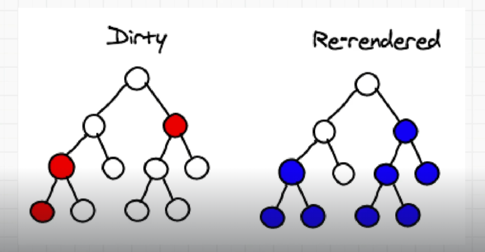

# React.js Funadmentals
## Introduction
- Basically replaces Jquery
- Can be used anywhere there is a view. Mobile apps included.
- Reusable components is one things that makes React great.
- In react data flows from top to bottom and never the other way around.
- If a node changes, only the children will know about the change.

- React creates the Viturual DOM which is a javascript object.
- The Virtual DOM object describes the current state of the website.
- React makes changes to the DOM in the most optimum way possible.
## React History and Latest Version (V19)
- 